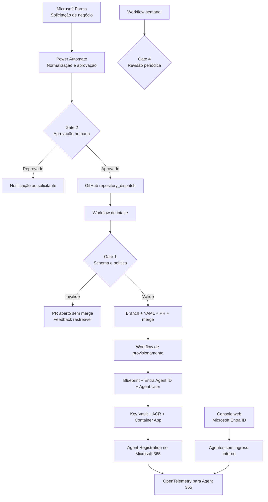

# Microsoft Agent 365 — Governed Agent Factory

Implementação de referência para transformar uma solicitação de negócio em um agente
provisionado com **identidade própria no Microsoft Entra**, **registro administrativo no
Microsoft 365**, **observabilidade no Agent 365** e **ciclo de revisão definido**.

O repositório integra Microsoft Forms, Power Automate, GitHub Actions e Azure para oferecer
um fluxo repetível de onboarding de agentes customizados — da solicitação à operação.

[](https://portal.azure.com/#create/Microsoft.Template/uri/https%3A%2F%2Fraw.githubusercontent.com%2Fbrunofreitas-br%2Fa365-agent-factory-reference%2Fmain%2Finfra%2Fazuredeploy.json)

> O botão provisiona a **fundação Azure compartilhada** a partir do template ARM versionado
> neste repositório. Em um fork, atualize a URL do botão para apontar para o template do fork.

> **Status da referência:** fluxo validado ponta a ponta em ambiente de laboratório. O
> Microsoft Agent 365 e algumas APIs utilizadas estão em preview.

---

## Visão geral

A solução estabelece um processo consistente para que cada agente tenha, desde a origem:

| Capacidade | Implementação |
|---|---|
| **Intake estruturado** | Microsoft Forms com perguntas em linguagem de negócio |
| **Decisão humana** | Power Automate Approvals antes da criação de recursos |
| **Policy as code** | JSON Schema e regras de política versionadas no repositório |
| **Identidade por agente** | Agent Identity Blueprint, Entra Agent ID e Agent User |
| **Runtime padronizado** | FastAPI + LangGraph em Azure Container Apps |
| **Segredos protegidos** | Azure Key Vault, acessado por managed identity |
| **Registro administrativo** | Agent Registration API no inventário do Microsoft 365 |
| **Observabilidade** | OpenTelemetry enviado ao Agent 365 pelo endpoint S2S |
| **Acesso controlado** | Console web protegido por autenticação do Microsoft Entra |
| **Revisão periódica** | GitHub issue criada quando a data de revisão se aproxima |

O agente de exemplo classifica textos por categoria e urgência. A lógica é deliberadamente
simples: o foco desta referência é o **control plane e o processo de governança**, não um
caso de uso específico.

---

## Arquitetura



### Princípios do desenho

- **Uma identidade A365 por agente:** blueprint e Agent ID nunca são compartilhados entre agentes.
- **Agentes sem exposição direta:** o runtime usa ingress interno; o console é a única porta web externa.
- **Sem segredo de pipeline:** GitHub Actions autentica no Azure por OIDC federado.
- **Configuração versionada:** cada solicitação aprovada vira um arquivo YAML revisável.
- **Separação de responsabilidades:** o dono de negócio aprova no Power Automate; a plataforma aplica políticas no pipeline.

---

## Governance Gates

| Gate | Controle | Onde ocorre | Resultado esperado |
|---|---|---|---|
| **Gate 1 — Policy validation** | Schema, combinações permitidas e classificação de risco | GitHub Actions | A automação mantém solicitações inválidas em PR, sem merge |
| **Gate 2 — Business approval** | Aprovação humana e comentário do revisor | Power Automate Approvals | Nenhum recurso é criado sem decisão registrada |
| **Gate 3 — Pre-deployment validation** | Revalidação e renderização determinística | Workflow de provisionamento | O pacote é validado novamente antes do deploy |
| **Gate 4 — Periodic review** | Revisão baseada em `review_date` | Workflow agendado + GitHub Issues | O dono decide manter, alterar ou descontinuar |

A aprovação de negócio permanece no Power Automate para não exigir que o aprovador tenha
uma conta GitHub. Os controles técnicos permanecem no repositório, onde são versionados e
auditáveis.

### Políticas incluídas

- finalidade com descrição mínima;
- data de revisão futura;
- alerta para ciclos de revisão superiores a 18 meses;
- alerta quando os responsáveis técnico e de negócio são a mesma pessoa;
- revisão adicional para dados restritos em produção;
- bloqueio de WorkIQ em autenticação S2S;
- bloqueio de perfis de runtime não suportados por este template;
- cálculo de risco a partir de sensibilidade, escrita, autonomia e ambiente.

---

## Componentes do repositório

| Caminho | Responsabilidade |
|---|---|
| [`infra/`](infra/) | Fundação Azure compartilhada e template compilado para Deploy to Azure |
| [`requests/`](requests/) | Solicitações aprovadas, uma por agente, e o JSON Schema |
| [`examples/`](examples/) | Solicitação neutra para copiar e adaptar |
| [`scripts/validate_request.py`](scripts/validate_request.py) | Gate 1 e classificação de risco |
| [`scripts/intake_from_dispatch.py`](scripts/intake_from_dispatch.py) | Conversão segura do payload do Forms em YAML |
| [`scripts/render_request.py`](scripts/render_request.py) | Renderização do agente, manifesto e parâmetros Bicep |
| [`scripts/provision_identity.py`](scripts/provision_identity.py) | Blueprint, principal, Entra Agent ID e Agent User |
| [`scripts/register_agent.py`](scripts/register_agent.py) | Registro administrativo no Microsoft 365 |
| [`scripts/agentes_para_revisar.py`](scripts/agentes_para_revisar.py) | Seleção de agentes próximos da revisão |
| [`template/agent/`](template/agent/) | Golden template FastAPI, LangGraph e OpenTelemetry |
| [`template/agent/purview.py`](template/agent/purview.py) | Avaliação de conteúdo com contexto fixo do agente e aplicação das decisões DLP |
| [`tests/`](tests/) | Regressões de observabilidade, políticas Purview e bloqueio no runtime |
| [`template/infra/`](template/infra/) | Azure Container App de cada agente |
| [`console/`](console/) | Console web autenticado para descoberta e invocação |
| [`.github/workflows/`](.github/workflows/) | Intake, validação, provisionamento e revisão periódica |
| [`forms/`](forms/) | Especificação do formulário de intake |
| [`power-automate/`](power-automate/) | Construção do flow Forms → Approval → GitHub |

### Workflows

| Workflow | Gatilho | Função |
|---|---|---|
| [`intake.yml`](.github/workflows/intake.yml) | `repository_dispatch` | Valida, cria branch, abre PR e realiza o merge |
| [`validate-request.yml`](.github/workflows/validate-request.yml) | `pull_request` e `push` do runtime em `main` | Testa o runtime; em PRs também executa os Gates técnicos das solicitações |
| [`provision-agent.yml`](.github/workflows/provision-agent.yml) | `workflow_run`, `push` ou manual | Provisiona identidade, runtime e registro |
| [`revisao-agentes.yml`](.github/workflows/revisao-agentes.yml) | agenda semanal ou manual | Abre uma issue quando a revisão se aproxima |

---

## Pré-requisitos

### Serviços

- tenant Microsoft 365 com Microsoft Agent 365 habilitado;
- assinatura Azure;
- Azure OpenAI com um deployment de chat compatível;
- Microsoft Forms e Power Automate;
- repositório GitHub com GitHub Actions habilitado.

### Papéis para configurar a referência

- papel administrativo capaz de conceder consentimento às permissões de aplicação do Microsoft Graph;
- `Owner` ou `User Access Administrator` no escopo Azure utilizado para criar role assignments;
- permissão administrativa no repositório GitHub.

### Ferramentas para implantação por linha de comando

- Azure CLI;
- GitHub CLI;
- Python 3.12, versão utilizada pelos workflows desta referência.

---

## Guia de implantação

### 1. Preparar o repositório

Crie um fork ou clone desta referência e defina a branch padrão como `main`.

O repositório pode permanecer privado. A automação usa permissões nativas do GitHub Actions
e OIDC; nenhum PAT é necessário no Power Automate.

Se o fork publicar seu próprio template ARM, atualize a URL codificada nos botões
**Deploy to Azure** para apontar para o `infra/azuredeploy.json` desse fork.

### 2. Criar a identidade do pipeline no Microsoft Entra

Crie uma aplicação single-tenant e seu service principal:

```bash
PIPELINE_APP_ID=$(az ad app create \
  --display-name "a365-agent-factory-registrar" \
  --sign-in-audience AzureADMyOrg \
  --query appId -o tsv)

az ad sp create --id "$PIPELINE_APP_ID"
PIPELINE_SP_OBJECT_ID=$(az ad sp show --id "$PIPELINE_APP_ID" --query id -o tsv)
```

A implementação foi validada com as seguintes **application permissions** do Microsoft Graph:

| Permissão | Uso na solução |
|---|---|
| `AgentIdentityBlueprint.ReadWrite.All` | Criar e consultar blueprints |
| `AgentIdentityBlueprintPrincipal.Create` | Criar o principal do blueprint |
| `AgentIdentityBlueprintPrincipal.ReadWrite.All` | Gerenciar o principal do blueprint |
| `AgentIdentityBlueprint.AddRemoveCreds.All` | Criar a credencial do blueprint |
| `AgentIdentity.Create.All` | Criar o Entra Agent ID |
| `AgentIdentity.ReadWrite.All` | Consultar e configurar o Agent ID |
| `Application.ReadWrite.OwnedBy` | Gerenciar aplicações criadas pelo pipeline |
| `User.ReadWrite.All` | Criar o Agent User e atribuir manager |
| `Directory.Read.All` | Resolver sponsor e objetos do diretório |
| `DelegatedPermissionGrant.ReadWrite.All` | Conceder os escopos delegados definidos pelo template |
| `AgentRegistration.ReadWrite.All` | Criar ou atualizar o registro administrativo |

Conceda **admin consent** após adicionar as permissões. A identidade do pipeline deve ser
tratada como uma identidade privilegiada e monitorada como tal.

### 3. Implantação da fundação Azure

A fundação cria:

- Azure Container Registry;
- Log Analytics Workspace;
- Azure Container Apps Environment;
- Azure Key Vault com RBAC e purge protection;
- managed identity dos agentes;
- managed identity do console;
- role assignments para ACR, Key Vault e leitura do inventário;
- `Contributor` e `Key Vault Secrets Officer` para o pipeline, quando o object ID é informado.

#### Opção A — Deploy to Azure (template em URL pública)

Utilize o botão no início deste README para abrir o template no Azure Portal.

Informe o `pipelinePrincipalId` obtido no passo anterior para que o template configure o
RBAC do pipeline.

O botão acima utiliza o template deste repositório. Para uma cópia independente, atualize
a URL para o template do fork ou utilize a opção B.

#### Opção B — Bicep pela Azure CLI

```bash
RG=rg-a365-agent-factory
LOCATION=eastus2

az group create --name "$RG" --location "$LOCATION"

az deployment group create \
  --name agent-factory-foundation \
  --resource-group "$RG" \
  --template-file infra/main.bicep \
  --parameters \
    namePrefix=a365factory \
    pipelinePrincipalId="$PIPELINE_SP_OBJECT_ID"
```

Consulte os valores necessários para configurar o GitHub:

```bash
az deployment group show \
  --name agent-factory-foundation \
  --resource-group "$RG" \
  --query properties.outputs.foundation.value
```

O template também possui um exemplo em [`infra/main.bicepparam`](infra/main.bicepparam).

### 4. Conceder acesso ao Azure OpenAI

A conta Azure OpenAI é tratada como recurso existente. Conceda à managed identity dos
agentes o papel `Cognitive Services OpenAI User` no escopo da conta:

```bash
AGENT_PRINCIPAL_ID=$(az identity show \
  --name id-a365factory-agent \
  --resource-group "$RG" \
  --query principalId -o tsv)

az role assignment create \
  --assignee-object-id "$AGENT_PRINCIPAL_ID" \
  --assignee-principal-type ServicePrincipal \
  --role "Cognitive Services OpenAI User" \
  --scope <AZURE_OPENAI_RESOURCE_ID>
```

### 5. Configurar OIDC entre GitHub e Microsoft Entra

Crie no GitHub o environment `a365-dev`. Depois, associe o subject à aplicação do pipeline:

```bash
az ad app federated-credential create --id "$PIPELINE_APP_ID" --parameters '{
  "name": "github-a365-dev",
  "issuer": "https://token.actions.githubusercontent.com",
  "subject": "repo:<owner>/<repo>:environment:a365-dev",
  "audiences": ["api://AzureADTokenExchange"]
}'
```

A partir desse ponto, `azure/login` usa um token efêmero emitido pelo GitHub. Não existe
client secret do pipeline no repositório.

### 6. Configurar o GitHub

Em **Settings → Actions → General → Workflow permissions**:

1. selecione **Read and write permissions**;
2. habilite **Allow GitHub Actions to create and approve pull requests**.

Ou aplique por CLI:

```bash
gh api -X PUT repos/<owner>/<repo>/actions/permissions/workflow \
  -F default_workflow_permissions=write \
  -F can_approve_pull_request_reviews=true
```

Configure as variáveis:

| Variável | Valor |
|---|---|
| `AZURE_CLIENT_ID` | appId da aplicação do pipeline |
| `AZURE_TENANT_ID` | ID do tenant |
| `AZURE_SUBSCRIPTION_ID` | ID da assinatura |
| `AZURE_RESOURCE_GROUP` | Resource group da fundação |
| `A365_ENVIRONMENT` | `dev` |
| `ACR_NAME` | output `acrName` |
| `ACA_ENVIRONMENT_ID` | output `containerAppsEnvironmentId` |
| `AGENT_IDENTITY_ID` | output `agentIdentityId` |
| `AGENT_IDENTITY_CLIENT_ID` | output `agentIdentityClientId` |
| `BLUEPRINT_SECRET_KV_NAME` | output `keyVaultName` |
| `BLUEPRINT_SECRET_KV_URI` | output `keyVaultUri` |
| `AZURE_OPENAI_ENDPOINT` | endpoint da conta Azure OpenAI |
| `AZURE_OPENAI_DEPLOYMENT` | nome do deployment de chat |
| `A365_TENANT_DOMAIN` | domínio inicial do tenant, por exemplo `contoso.onmicrosoft.com` |
| `AGENT_FACTORY_PRINCIPAL_ID` | object ID do service principal do pipeline |
| `AGENT_OWNER_OBJECT_IDS` | object IDs dos responsáveis, separados por vírgula |
| `A365_AGENT_REGISTRATION_ENABLED` | `true` |
| `PURVIEW_ENABLED` | Opcional, padrão `false`. Ativar somente após validar os pré-requisitos Purview do agente |
| `PURVIEW_CHECK_OUTPUT` | Opcional, padrão `false`. Exige avaliação inline também para a resposta final |

Exemplo:

```bash
gh variable set AZURE_CLIENT_ID -R <owner>/<repo> -b "$PIPELINE_APP_ID"
```

Blueprint e Agent ID são valores **por agente**. O workflow recebe ambos diretamente do
provisionamento e não utiliza variáveis fixas para esses identificadores.
O Agent User também vem do output `agent_user_id`; não substituí-lo pelo invocador ou pelo sponsor.

### 7. Criar o Forms e o flow do Power Automate

- Crie o formulário conforme [`forms/solicitacao-de-agente.md`](forms/solicitacao-de-agente.md).
- Implemente o flow conforme [`power-automate/flow-forms-to-pr.md`](power-automate/flow-forms-to-pr.md).
- Use `nova-solicitacao-agente` como event name no repository dispatch.

O conector GitHub do Power Automate executa apenas o dispatch. A transformação em YAML, a
validação, o PR e o merge permanecem no GitHub Actions.

### 8. Executar o primeiro onboarding

1. Preencha o Forms.
2. Aprove a solicitação recebida no Power Automate.
3. Acompanhe o workflow **Intake de solicitação**.
4. Confirme o PR e o novo arquivo em [`requests/`](requests/).
5. Acompanhe o workflow **Provisionar agente**.
6. Confirme o Container App e o registro no Microsoft 365.

O provisionamento também pode ser iniciado manualmente:

```bash
gh workflow run provision-agent.yml \
  -R <owner>/<repo> \
  -f request=requests/<agente>.yaml
```

Para um teste sem Forms, copie
[`examples/classificador-de-chamados.yaml`](examples/classificador-de-chamados.yaml) para
`requests/`, atualize responsáveis e `review_date`, e abra um PR.

---

## Console autenticado

O console web é uma superfície única para descobrir e invocar os agentes provisionados.
Ele consulta Container Apps com a tag `a365-managed-by=agent-factory`, portanto novos agentes
aparecem automaticamente.

O desenho de segurança utiliza:

- ingress externo somente no console;
- ingress interno nos agentes;
- autenticação nativa do Azure Container Apps com Microsoft Entra ID;
- atribuição explícita de usuários no enterprise application;
- managed identity do console com `Reader` no resource group e `AcrPull` no registry;
- resolução do endereço do agente no servidor, evitando aceitar URLs enviadas pelo navegador.

O código, container e Bicep estão em [`console/`](console/). A fundação Azure já cria a
managed identity do console e os papéis `Reader` e `AcrPull` necessários.

<details>
<summary><strong>Implantar e proteger o console</strong></summary>

Recupere os outputs da fundação e publique a imagem:

```bash
ACR_NAME=$(az deployment group show -g "$RG" -n agent-factory-foundation \
  --query properties.outputs.foundation.value.acrName -o tsv)
ACA_ENVIRONMENT_ID=$(az deployment group show -g "$RG" -n agent-factory-foundation \
  --query properties.outputs.foundation.value.containerAppsEnvironmentId -o tsv)
CONSOLE_IDENTITY_ID=$(az deployment group show -g "$RG" -n agent-factory-foundation \
  --query properties.outputs.foundation.value.consoleIdentityId -o tsv)
CONSOLE_IDENTITY_CLIENT_ID=$(az deployment group show -g "$RG" -n agent-factory-foundation \
  --query properties.outputs.foundation.value.consoleIdentityClientId -o tsv)

az acr build \
  --registry "$ACR_NAME" \
  --image agent-console:v1 \
  --file console/Dockerfile \
  console/

az deployment group create \
  --name agent-factory-console \
  --resource-group "$RG" \
  --template-file console/infra/console.bicep \
  --parameters \
    managedEnvironmentId="$ACA_ENVIRONMENT_ID" \
    image="$ACR_NAME.azurecr.io/agent-console:v1" \
    acrLoginServer="$ACR_NAME.azurecr.io" \
    userAssignedIdentityId="$CONSOLE_IDENTITY_ID" \
    userAssignedIdentityClientId="$CONSOLE_IDENTITY_CLIENT_ID"

CONSOLE_FQDN=$(az containerapp show -g "$RG" -n ca-agent-console \
  --query properties.configuration.ingress.fqdn -o tsv)
```

Crie a aplicação single-tenant do console com o callback do EasyAuth:

```bash
CONSOLE_APP_ID=$(az ad app create \
  --display-name "A365 Agent Console" \
  --sign-in-audience AzureADMyOrg \
  --web-redirect-uris "https://$CONSOLE_FQDN/.auth/login/aad/callback" \
  --enable-id-token-issuance true \
  --query appId -o tsv)

az ad sp create --id "$CONSOLE_APP_ID"
az ad sp update --id "$CONSOLE_APP_ID" --set appRoleAssignmentRequired=true
```

Crie a credencial usada pelo EasyAuth, armazene-a como secret do Container App e ative o
provedor Microsoft Entra:

```bash
TENANT_ID=$(az account show --query tenantId -o tsv)
CONSOLE_SECRET=$(az ad app credential reset \
  --id "$CONSOLE_APP_ID" --append --years 1 --query password -o tsv)

az containerapp secret set -g "$RG" -n ca-agent-console \
  --secrets "aad-client-secret=$CONSOLE_SECRET"
unset CONSOLE_SECRET

az containerapp auth microsoft update -g "$RG" -n ca-agent-console \
  --client-id "$CONSOLE_APP_ID" \
  --client-secret-name aad-client-secret \
  --issuer "https://login.microsoftonline.com/$TENANT_ID/v2.0" \
  --allowed-audiences "api://$CONSOLE_APP_ID" \
  --yes

az containerapp auth update -g "$RG" -n ca-agent-console \
  --enabled true \
  --action RedirectToLoginPage \
  --redirect-provider azureactivedirectory \
  --require-https true
```

Por fim, em **Microsoft Entra admin center → Enterprise applications → A365 Agent Console →
Users and groups**, atribua os usuários ou grupos autorizados. Como
`appRoleAssignmentRequired` está habilitado, uma conta do tenant sem atribuição não obtém
acesso.

</details>

---

## Revisão periódica

O workflow [`revisao-agentes.yml`](.github/workflows/revisao-agentes.yml) é executado às
segundas-feiras, 12h UTC, e avalia a `review_date` de todas as solicitações. Por padrão, o
Gate 4 é aberto sete dias antes do vencimento.

Para cada agente elegível, o workflow cria uma issue com finalidade, responsáveis,
ambiente, sensibilidade e data de revisão. Enquanto uma issue equivalente estiver aberta,
uma nova não é criada.

O responsável registra uma das decisões:

1. **Manter:** atualiza `review_date` por PR e fecha a issue.
2. **Alterar:** atualiza escopo, responsáveis ou classificação por PR e fecha a issue após o deploy.
3. **Descontinuar:** inicia o processo de descomissionamento definido pela organização.

O workflow também pode ser executado manualmente, com antecedência configurável, pela aba
GitHub Actions.

---

## Proteção Purview opcional

A integração é **centrada no agente**, não no usuário que o invocou. O runtime consulta as
políticas usando um Agent User fixo e uma aplicação protegida configurada no deploy.
A autenticação e a autorização do chamador continuam independentes desse controle.

**Estado:** implementação coberta por testes locais e por validação inline em tenant de teste,
com Agent User fixo: conteúdo permitido, prompt sensível bloqueado e retorno sintético de
ferramenta bloqueado. Isso não certifica outras políticas, agentes ou tenants. A evidência no
portal continua uma verificação separada. O recurso permanece desligado por padrão na Factory;
a ativação deve ser explícita em cada implantação preparada.

### Pontos de controle

| Conteúdo | Momento | Atividade enviada |
|---|---|---|
| Prompt recebido | Antes de chamar o grafo, modelo ou ferramentas | `uploadText` |
| Retorno textual da ferramenta | Antes de publicar o resultado no estado do grafo ou retorná-lo ao chamador | `uploadText`, como entrada do agente, sujeito à validação no tenant |
| Resposta final, opcional | Antes de entregar qualquer campo da resposta HTTP | `downloadText` |

O nó `act` do exemplo ainda simula uma operação. Ao adicionar ferramentas reais, manter a
avaliação do conteúdo antes de publicá-lo no grafo, enviá-lo a outro modelo ou entregá-lo ao
usuário. Esse controle não desfaz efeitos de uma ferramenta já executada nem substitui ACLs.

### Pré-requisitos e configuração

1. Confirmar o Agent User pertencente à identidade runtime do agente. O App ID, o service
   principal e o sponsor não são substitutos para o `userId` exigido pela API.
2. Validar licenciamento e habilitar pay-as-you-go do Purview com aprovação administrativa.
3. Conceder as permissões de aplicação Graph `ProtectionScopes.Compute.User` e
   `Content.Process.User` à identidade chamadora, diretamente ou por herança configurada
   no blueprint. O pipeline não concede essas permissões automaticamente.
4. Configurar e validar uma política DLP que cubra a aplicação e o Agent User. A configuração de DLP
   para aplicações Entra usa PowerShell. Uma política de coleta offline, sozinha, não atende
   ao requisito de bloqueio inline desta implementação. Coleta e retenção de conteúdo devem
   ser uma decisão explícita do administrador.
5. Habilitar `PURVIEW_ENABLED=true` somente no escopo de implantação preparado. O workflow
   lê essa variável do repositório ou GitHub Environment: ela afeta os próximos provisionamentos
   e redeploys que utilizarem esse escopo, não altera agentes já implantados por si só.

Configuração própria não significa regras diferentes ou uma política obrigatoriamente exclusiva
para cada agente. A Factory exige uma política aplicável ao contexto configurado; regras
corporativas podem ser reutilizadas, com o escopo de aplicações e identidades validado pelo
administrador. Políticas de outros workloads não passam a proteger o agente automaticamente.

A golden baseline distribui código de avaliação, não a política do tenant, grants, licenças ou
IDs do ambiente de origem. Por agente, o pipeline passa seu Agent User e sua aplicação protegida;
o administrador prepara os grants e a política antes da ativação. No workflow atual, as flags
Purview não são campos individuais do formulário ou da solicitação. Para ativação isolada,
usar configuração explícita no deploy daquele agente, sem habilitar o repositório inteiro.
Com a integração habilitada, ausência de escopo inline aplicável interrompe a invocação com
HTTP 503; não há liberação silenciosa nem uso da identidade de outro agente.

O Bicep recebe o objeto `purview` com `enabled`, `agentUserId`, `applicationId` e `checkOutput`.
O workflow preenche o Agent User a partir do provisionamento e deixa `applicationId` vazio
para usar o Entra Agent ID como aplicação protegida. Um deploy direto pode configurar outra
aplicação explicitamente, desde que corresponda ao alvo da política validada.

No container, as variáveis são `PURVIEW_ENABLED`, `PURVIEW_AGENT_USER_ID`,
`PURVIEW_APPLICATION_ID` e `PURVIEW_CHECK_OUTPUT`. O token Graph usa a cadeia S2S existente
com o recurso `https://graph.microsoft.com/.default`, em uma instância e cache separados
do token de observabilidade. Não há fallback para a identidade humana ou outra aplicação.

### Decisões e limites

- `protectionScopes/compute` é armazenado em cache por até cinco minutos, isolado por cliente
  de agente. Seu `ETag` vai em `If-None-Match`. `protectionScopeState=modified` invalida o cache;
  uma decisão de conteúdo sem bloqueio exige nova consulta e validação dos escopos antes de
  prosseguir, sem reenviar o conteúdo já avaliado. Erro no refresh, perda de escopo inline ou
  restrição nova interrompem a operação. Um bloqueio nunca é repetido como tentativa de liberação.
- `restrictAccess/block` devolve HTTP 403 com `PURVIEW_DLP_BLOCKED`. `warn` também interrompe
  a operação com `PURVIEW_CONFIRMATION_REQUIRED`; não existe override nesta versão.
- Uma ação `audit` pode prosseguir quando a avaliação inline foi concluída. Os logs registram
  `audited`, sem conteúdo da conversa.
- Falta de escopo inline, HTTP 202/204 sem decisão, erro de processamento, timeout ou resposta
  desconhecida devolvem HTTP 503 com `PURVIEW_EVALUATION_UNAVAILABLE`, sem liberar conteúdo.
- O limite preventivo **desta implementação** é 64 KiB de texto UTF-8 por avaliação. Conteúdo
  maior é interrompido, não truncado. Isso não descreve um limite do serviço Purview.
- Não há envio de prompts/resultados aos logs do aplicativo. A inspeção envia o conteúdo ao
  Purview; eventual armazenamento depende das políticas de coleta do tenant.
- `PURVIEW_CHECK_OUTPUT=true` exige escopo inline para `downloadText`. A documentação do
  cenário garante DLP para prompts por tipos de informação sensível; não assumir suporte a
  bloqueio de saída apenas porque a API aceita essa atividade.
- `/healthz` mede a disponibilidade do processo, não a aplicação da política Purview.

### Testes

Em um ambiente Python 3.12 isolado:

```bash
python -m pip install -r template/agent/requirements.txt
python -m unittest discover -s tests -p 'test_*.py' -v
```

Os testes não usam credenciais, modelo real ou chamadas externas. Antes de produção, validar
conteúdo permitido, bloqueio de prompt com zero chamadas ao modelo, bloqueio do retorno da
ferramenta, mudança de política e indisponibilidade da avaliação, além da evidência no Purview.

## Validação operacional

Após o primeiro deploy, valide três planos independentes:

### Runtime

```bash
az containerapp revision list \
  --name <container-app-name> \
  --resource-group "$RG" \
  --query "[?properties.active].{health:properties.healthState,state:properties.runningState}"
```

Resultado esperado: revisão `Healthy` e `Running`.

### Registro

Confirme no Microsoft 365 Admin Center que o agente aparece com:

- identidade correta;
- responsáveis definidos;
- URL correspondente ao FQDN real do Container App.

### Observabilidade

Depois de invocar o agente pelo console, o log deve confirmar:

```text
Observabilidade A365 ativa para o agente <agent-id>
Token de recurso do agente renovado.
A365 export: http=200 routing=confirmed ...
```

O `<agent-id>` deve corresponder ao Entra Agent ID criado para aquele agente.
O exportador confere `partialSuccess` e `results`. Mesmo com roteamento confirmado, conferir
os eventos `InvokeAgent`, `InferenceCall` e `ExecuteToolBySDK` no `CloudAppEvents` para validar
a indexação no Defender. HTTP 200, isoladamente, não comprova essa entrega.

---

## Escopo desta implementação

Esta referência implementa agentes customizados, hospedados em Azure Container Apps, com
autenticação S2S e observabilidade no Microsoft Agent 365. O golden template pode ser
evoluído para outros frameworks e modelos de autenticação preservando os mesmos Gates e o
mesmo contrato de governança.

As APIs de Agent Identity e Agent Registration utilizadas pelo pipeline estão em preview.
Antes de promover a solução para produção, valide versões de API, políticas de rede,
monitoramento, rotação de credenciais e requisitos regulatórios da organização.

---

## Referências

- [Microsoft Agent 365 Developer documentation](https://learn.microsoft.com/microsoft-agent-365/developer/)
- [Microsoft Agent 365 skills](https://github.com/microsoft/agent365-skills)
- [Microsoft Agent 365 samples](https://github.com/microsoft/Agent365-Samples)
- [Workload identity federation for GitHub Actions](https://learn.microsoft.com/entra/workload-id/workload-identity-federation)
- [Azure Container Apps authentication](https://learn.microsoft.com/azure/container-apps/authentication)
- [Integração das APIs Purview](https://learn.microsoft.com/purview/developer/use-the-api)
- [Purview para aplicações Entra](https://learn.microsoft.com/purview/ai-entra-registered)
- [Contrato processContent](https://learn.microsoft.com/graph/api/userdatasecurityandgovernance-processcontent?view=graph-rest-1.0)

## Licença

Disponibilizado sob a [MIT License](LICENSE).
